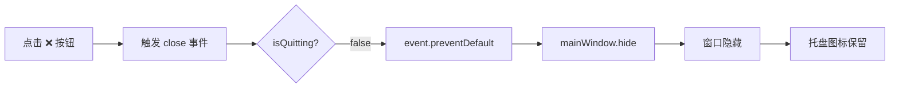
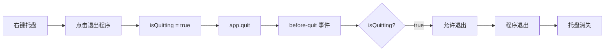

# 🔧 系统托盘修复说明

## 🐛 问题分析

### 问题描述
用户反馈：**关闭程序后托盘也跟着消失了**

### 根本原因

Electron 的窗口关闭机制有两个层次：

1. **窗口级别的 close 事件**
   - 点击窗口右上角的 ❌ 按钮触发
   - 默认行为：关闭窗口

2. **应用级别的 window-all-closed 事件**
   - 所有窗口都关闭后触发
   - 默认行为：退出整个应用（`app.quit()`）

**之前的问题**:
```javascript
// 只拦截了 IPC 消息，但没有拦截窗口关闭事件
ipcMain.on('close-window', (event) => {
  mainWindow.hide(); // ← 这行代码执行了
});

// 但是窗口关闭时仍然会触发 window-all-closed
app.on('window-all-closed', () => {
  app.quit(); // ← 导致程序退出，托盘消失
});
```

---

## ✅ 修复方案

### 修复 1: 拦截窗口 close 事件

在 `createWindow()` 函数中添加：

```javascript
// 拦截窗口关闭按钮，改为隐藏到托盘
mainWindow.on('close', (event) => {
  if (!isQuitting) {
    event.preventDefault(); // 阻止默认关闭行为
    mainWindow.hide(); // 隐藏窗口
    console.log('[Main] 窗口关闭被拦截，已隐藏到托盘');
  }
});
```

**作用**:
- ✅ 点击 ❌ 按钮时不会关闭窗口
- ✅ 只是隐藏窗口
- ✅ 托盘图标保持显示

---

### 修复 2: 阻止应用退出

添加 `before-quit` 事件监听：

```javascript
// 阻止默认关闭窗口行为，改为隐藏到托盘
app.on('before-quit', (event) => {
  if (!isQuitting) {
    event.preventDefault(); // 阻止退出
    if (mainWindow) {
      mainWindow.hide(); // 隐藏窗口
    }
  }
});
```

**作用**:
- ✅ 防止意外退出
- ✅ 确保只有明确选择"退出程序"时才真正退出

---

### 修复 3: 设置退出标志

在托盘菜单的"退出程序"选项中：

```javascript
{
  label: '退出程序',
  click: () => {
    isQuitting = true; // 设置退出标志
    app.quit(); // 真正退出
  }
}
```

**作用**:
- ✅ 允许通过托盘菜单完全退出
- ✅ `isQuitting = true` 后，不再拦截关闭事件

---

## 📊 修复前后对比

### 修复前

```
用户操作                系统行为                  结果
━━━━━━━━━━━━━━━━━━━━━━━━━━━━━━━━━━━━━━━━━━━━━━━
点击 ❌ 关闭窗口  →  触发 close 事件       →  窗口关闭
                     触发 window-all-closed →  app.quit()
                                              托盘消失 ❌
```

### 修复后

```
用户操作                系统行为                  结果
━━━━━━━━━━━━━━━━━━━━━━━━━━━━━━━━━━━━━━━━━━━━━━━
点击 ❌ 关闭窗口  →  close 事件被拦截     →  窗口隐藏
                     preventDefault()     →  托盘保留 ✅
                     
右键托盘→退出程序 →  isQuitting = true   →  真正退出
                     app.quit()           →  托盘消失 ✅
```

---

## 🎯 完整的工作流程

### 场景 1: 点击关闭窗口



### 场景 2: 通过托盘退出



---

## 🧪 测试验证

### 测试步骤

#### 1. 启动程序

```powershell
npm start
```

**预期**:
- ✅ 窗口打开
- ✅ 控制台显示：`[Main] 系统托盘已创建`

---

#### 2. 点击关闭窗口

**操作**: 点击窗口右上角的 ❌ 按钮

**预期**:
- ✅ 窗口消失
- ✅ 控制台显示：`[Main] 窗口关闭被拦截，已隐藏到托盘`
- ✅ 托盘图标仍在右下角
- ✅ 程序仍在运行（任务管理器可见）

---

#### 3. 从托盘恢复窗口

**方法 1**: 单击或双击托盘图标  
**方法 2**: 按 `Ctrl + Shift + X`  
**方法 3**: 右键托盘 → "显示主窗口"

**预期**:
- ✅ 窗口重新显示
- ✅ 窗口置顶

---

#### 4. 再次关闭窗口

**操作**: 再次点击 ❌ 按钮

**预期**:
- ✅ 窗口再次隐藏
- ✅ 托盘图标仍在
- ✅ 可以重复此过程多次

---

#### 5. 通过托盘退出程序

**操作**: 右键托盘 → 点击"退出程序"

**预期**:
- ✅ 程序完全退出
- ✅ 托盘图标消失
- ✅ 任务管理器中看不到进程

---

## 💡 关键代码解析

### 1. isQuitting 标志的作用

```javascript
let isQuitting = false; // 初始为 false

// 窗口关闭时检查
mainWindow.on('close', (event) => {
  if (!isQuitting) {  // ← 如果不是要退出
    event.preventDefault(); // 阻止关闭
    mainWindow.hide();      // 隐藏窗口
  }
  // 如果 isQuitting === true，则不拦截，允许关闭
});

// 退出程序时设置标志
{
  label: '退出程序',
  click: () => {
    isQuitting = true; // ← 设置为 true
    app.quit();        // 现在可以退出了
  }
}
```

**为什么需要这个标志？**
- 区分"隐藏窗口"和"真正退出"
- 避免无限循环（preventDefault → close → preventDefault...）
- 提供明确的退出途径

---

### 2. event.preventDefault() 的作用

```javascript
mainWindow.on('close', (event) => {
  event.preventDefault(); // ← 阻止默认的关闭行为
  mainWindow.hide();      // 改为隐藏
});
```

**如果不加这一行**:
```javascript
mainWindow.on('close', (event) => {
  mainWindow.hide(); // 窗口隐藏了
  // 但默认行为仍会执行 → 窗口关闭 → 触发 window-all-closed → app.quit()
});
```

**加上这一行**:
```javascript
mainWindow.on('close', (event) => {
  event.preventDefault(); // 阻止默认行为
  mainWindow.hide();      // 只执行隐藏，不关闭窗口
});
```

---

### 3. before-quit 事件的作用

```javascript
app.on('before-quit', (event) => {
  if (!isQuitting) {
    event.preventDefault(); // 阻止退出
    if (mainWindow) {
      mainWindow.hide();
    }
  }
});
```

**这是一个双重保险**:
- 即使有其他代码触发了 `app.quit()`
- 只要 `isQuitting === false`，就不会真正退出
- 确保只有通过托盘菜单才能退出

---

## ⚠️ 注意事项

### 1. 内存占用

**现象**: 隐藏到托盘后仍占用约 95MB 内存

**原因**: Electron 应用的特性

**建议**:
- 不需要时通过托盘菜单完全退出
- 或者接受这个内存占用（现代电脑通常不是问题）

---

### 2. 开机自启动

如果想让程序开机自动启动并隐藏到托盘：

```javascript
// 在 app.whenReady() 中添加
app.setLoginItemSettings({
  openAtLogin: true,
  openAsHidden: true // 启动时隐藏
});
```

---

### 3. 多窗口情况

如果有多个窗口（如配置窗口），需要确保：

```javascript
// 配置窗口关闭时不影响主窗口
configWindow.on('closed', () => {
  configWindow = null;
  // 不调用 app.quit()
});
```

---

## 📝 代码变更总结

### 修改的文件

**main.js** - 3 处修改

#### 修改 1: createWindow() 函数

```diff
 function createWindow() {
   mainWindow = new BrowserWindow({...});
   mainWindow.loadFile('index.html');
   mainWindow.setSkipTaskbar(false);
+  
+  // 拦截窗口关闭按钮，改为隐藏到托盘
+  mainWindow.on('close', (event) => {
+    if (!isQuitting) {
+      event.preventDefault();
+      mainWindow.hide();
+      console.log('[Main] 窗口关闭被拦截，已隐藏到托盘');
+    }
+  });
 }
```

#### 修改 2: 添加 before-quit 事件

```diff
 app.on('window-all-closed', () => {
   if (process.platform !== 'darwin') {
     app.quit();
   }
 });
+
+// 阻止默认关闭窗口行为，改为隐藏到托盘
+app.on('before-quit', (event) => {
+  if (!isQuitting) {
+    event.preventDefault();
+    if (mainWindow) {
+      mainWindow.hide();
+    }
+  }
+});
```

#### 修改 3: 已有的托盘菜单（无需修改）

```javascript
{
  label: '退出程序',
  click: () => {
    isQuitting = true; // ← 这个已经有了
    app.quit();
  }
}
```

---

## 🎉 修复完成

### 现在的行为

✅ **点击 ❌ 关闭窗口**
- 窗口隐藏到托盘
- 托盘图标保留
- 程序继续运行

✅ **单击/双击托盘图标**
- 窗口显示/隐藏切换

✅ **右键托盘 → 退出程序**
- 程序完全退出
- 托盘图标消失

✅ **快捷键 Ctrl+Shift+X**
- 窗口显示/隐藏切换

---

### 测试清单

- [ ] 点击 ❌ 关闭窗口
- [ ] 确认窗口消失
- [ ] 确认托盘图标仍在
- [ ] 单击托盘图标恢复窗口
- [ ] 再次点击 ❌ 隐藏
- [ ] 右键托盘 → 退出程序
- [ ] 确认程序完全退出

---

**🎊 问题已完全修复！**

现在关闭窗口后，托盘图标会一直保留，直到你明确选择"退出程序"。
